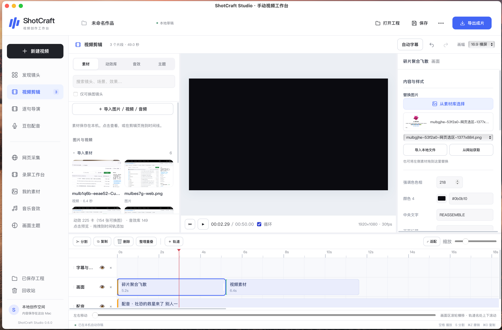
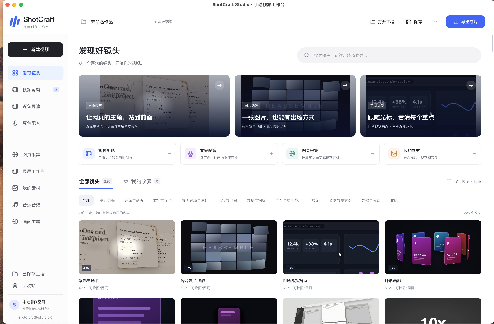
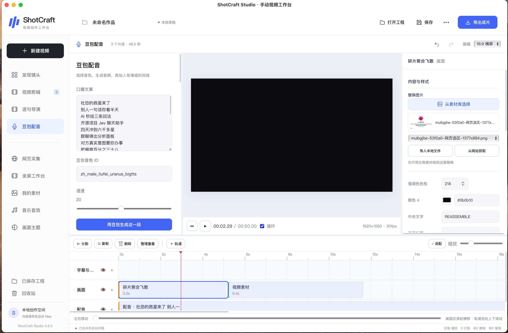
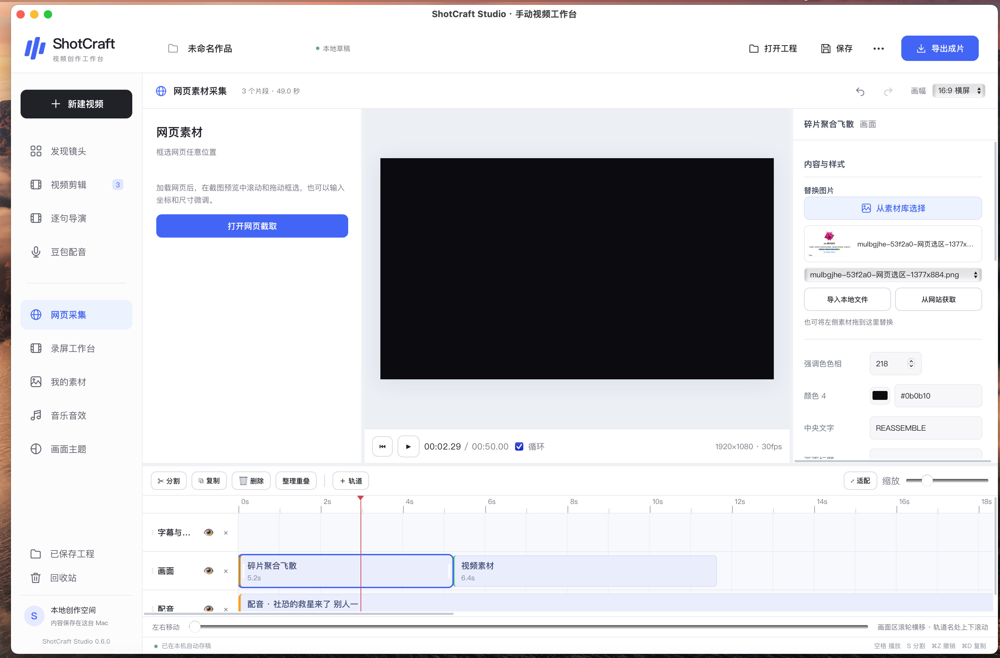
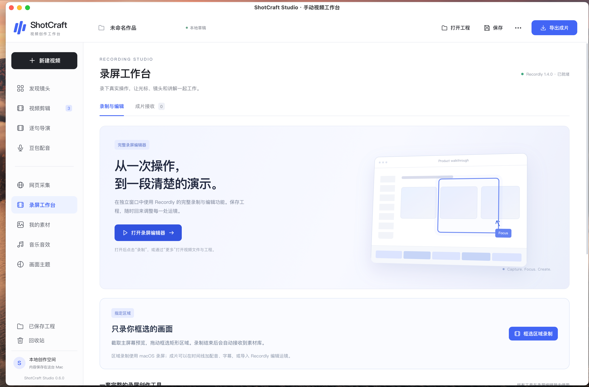

# ShotCraft Studio

> **A local editing workbench for knowledge-video creators**  
> Shape narration, captions, webpage evidence, editable shots, and MP4 export on a multitrack timeline.

**macOS · Local projects and media · 216 editable shots · Remotion · Doubao voice · MP4 export**

[简体中文](README.md) · [Agent Skill](SKILL.md) · [Third-party notices](THIRD_PARTY_NOTICES.md)

---

## Get started

This repository provides buildable desktop-workbench source code. A signed installer is not currently available. To run the development version locally on macOS:

```bash
cd workbench
npm ci
npm run build
STUDIO_DATA="$HOME/Movies/ShotCraft Studio" STUDIO_PORT=5296 node server/server.mjs
```

Then open <http://127.0.0.1:5296>.

Requirements: macOS, Node.js 20 or later, npm, and Chromium/Chrome for video rendering. Doubao voice generation requires your own service credentials. Web capture, recording, and thumbnails may need additional local browser or media components. `STUDIO_DATA` selects the local data directory. Do not commit projects, media, rendered videos, or credentials from that directory.

## Demo video and screenshots

https://github.com/user-attachments/assets/60a858d8-31bf-4d38-95f0-c624dfcedd6a

[Open or download the MP4 demo](docs/media/workbench-demo.mp4)

<p align="center">
  <a href="docs/media/timeline-editor.png"></a>
  <a href="docs/media/shot-library.png"></a>
</p>
<p align="center"><sub>Multitrack editing · Shot discovery and templates</sub></p>

<p align="center">
  <a href="docs/media/doubao-voice.png"></a>
  <a href="docs/media/web-capture.png"></a>
</p>
<p align="center"><sub>Doubao voice-over · Webpage region capture</sub></p>

<p align="center">
  <a href="docs/media/recording-studio.png"></a>
</p>
<p align="center"><sub>Recording workspace with region capture</sub></p>

## What you can do

| Stage | Capabilities |
| --- | --- |
| Organize | Multitrack editing with drag, trim, split, duplicate, undo, and redo |
| Choose shots | Browse 216 Remotion shots; replace images and text and adjust parameters per shot |
| Add media | Local asset library, batch image assignment, translated webpage preview, and region capture |
| Narrate | Doubao voice selection, word timing, automatic captions, and direct narration-to-track insertion |
| Preview and export | Remotion preview and local MP4 export |
| Manage projects | Local project and asset management with a trash; optional Recordly recording integration |

## From script to video

1. Create a project and add narration or media to the timeline.
2. Choose shot templates and replace their visuals and text. For webpage evidence, translate the preview and capture a region.
3. Add narration and captions, then arrange shot order and duration on the timeline.
4. Preview and export an MP4. Projects and imported media stay on the local machine by default.

## Repository layout

```text
SKILL.md                         Agent instructions
workbench/                       Workbench frontend and local Node server
vendor/video-shotcraft/demos/    Remotion shot sources
vendor/video-shotcraft/assets/   Shot and audio assets
vendor/recordly-source/          Recordly upstream source and license
native/                          macOS shell sources
```

Install this repository in an Agent Skills-compatible tool and follow [`SKILL.md`](SKILL.md) to help users launch and operate their local workbench. The skill assumes ShotCraft Studio is installed and configured on the user's Mac.

## Platform and release status

| Item | Status |
| --- | --- |
| macOS workbench source | Published; build and run locally using the steps above |
| Signed desktop installer | Not currently available |
| Recordly recording integration | Optional upstream source; not a standalone recording service |

This repository excludes signed app bundles, bundled Node binaries, prebuilt Recordly native tools, and user data. A general-purpose desktop packaging workflow still needs to be prepared.

## Provenance, licensing, and privacy

Shot sources and core workbench code originate from [Video Shotcraft](https://github.com/Vincentwei1021/video-talkcraft), which uses Apache-2.0. The optional Recordly integration source originates from [Recordly](https://github.com/webadderallorg/Recordly) and retains its upstream AGPL-3.0 license, attribution, and branding requirements. Dependencies and bundled assets may have their own terms; review [`THIRD_PARTY_NOTICES.md`](THIRD_PARTY_NOTICES.md) and each component's license before redistribution.

The repository-level Apache-2.0 license applies only to original ShotCraft Studio contributions where the contributor has the rights to grant it; it does not replace third-party licenses. Recordly remains under AGPL-3.0.

The workbench binds to the local loopback interface by default. API credentials are stored in local configuration and must not be committed, posted in issues, or copied into logs. Before publishing changes, review commit history, screenshots, media, and configuration files for personal content or secrets.
